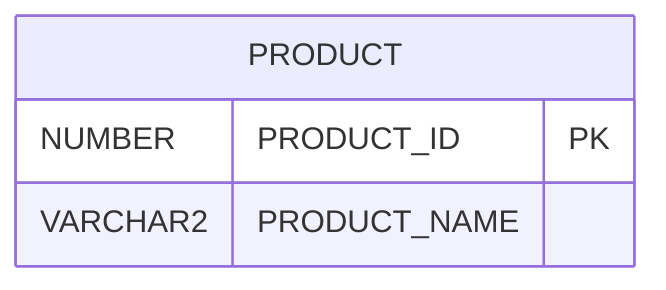

# ERD 생성 가이드

Oracle DB의 테이블 Comments와 제약조건을 기반으로 Mermaid ERD를 생성하는 방법입니다.

## 방법 1: Python 스크립트로 자동 생성

### 1. ERD 생성 스크립트 실행

```powershell
python generate_erd.py
```

이 스크립트는 다음을 수행합니다:
- Oracle DB에 연결
- 모든 테이블의 구조 조회
- 테이블 Comments와 컬럼 Comments 조회
- Primary Key와 Foreign Key 관계 조회
- `ERD.mmd` 파일 생성

### 2. 생성된 ERD 파일 확인

생성된 `ERD.mmd` 파일은 Mermaid 형식의 ERD 다이어그램입니다.

## 방법 2: GitHub에 업로드하여 자동 렌더링

### GitHub에 업로드하는 방법

1. **파일을 Git에 추가**
   ```powershell
   git add ERD.mmd
   ```

2. **커밋**
   ```powershell
   git commit -m "Add ERD diagram"
   ```

3. **GitHub에 푸시**
   ```powershell
   git push
   ```

4. **GitHub에서 확인**
   - GitHub 저장소로 이동
   - `ERD.mmd` 파일을 클릭
   - GitHub가 자동으로 Mermaid 다이어그램을 렌더링합니다!

### GitHub에서 자동 렌더링되는 형식

GitHub는 `.mmd` 파일과 마크다운 파일 내의 Mermaid 코드 블록을 자동으로 렌더링합니다.

예시:
````markdown

````

## 방법 3: LLM을 사용한 ERD 생성 프롬프트

Python 스크립트를 실행할 수 없는 경우, 다음 프롬프트를 LLM에게 제공하세요:

---

### LLM 프롬프트 (Oracle DB ERD 생성용)

```
다음 Oracle DB 스키마 정보를 기반으로 Mermaid ERD 다이어그램을 생성해주세요.

[여기에 다음 정보를 제공하세요]

1. 테이블 목록과 각 테이블의 Comment
2. 각 테이블의 컬럼 정보 (이름, 데이터 타입, NULL 여부, Comment)
3. Primary Key 정보
4. Foreign Key 관계 정보

형식:
- 테이블명: [테이블 Comment]
  - 컬럼명 (데이터타입) [PK/FK] - [컬럼 Comment]
  - ...

Foreign Key 관계:
- 테이블1.컬럼1 -> 테이블2.컬럼2

요구사항:
1. Mermaid ERD 형식으로 작성
2. 모든 테이블 Comments와 컬럼 Comments를 포함
3. Primary Key는 PK로 표시
4. Foreign Key 관계는 화살표로 표시
5. 코드 블록은 ```mermaid로 시작

출력 형식:
\`\`\`mermaid
erDiagram
    TABLE1 {
        "테이블 Comment"
        데이터타입 컬럼명 PK "컬럼 Comment"
        ...
    }
    TABLE2 ||--o{ TABLE1 : "관계 설명"
\`\`\`
```

---

## Oracle DB에서 스키마 정보 추출 SQL

ERD 생성을 위해 필요한 정보를 추출하는 SQL 쿼리:

### 1. 테이블 목록과 Comments
```sql
SELECT TABLE_NAME, COMMENTS
FROM USER_TAB_COMMENTS
WHERE COMMENTS IS NOT NULL
ORDER BY TABLE_NAME;
```

### 2. 컬럼 정보와 Comments
```sql
SELECT 
    t.TABLE_NAME,
    t.COLUMN_NAME,
    t.DATA_TYPE,
    t.DATA_LENGTH,
    t.DATA_PRECISION,
    t.DATA_SCALE,
    t.NULLABLE,
    c.COMMENTS
FROM USER_TAB_COLUMNS t
LEFT JOIN USER_COL_COMMENTS c 
    ON t.TABLE_NAME = c.TABLE_NAME 
    AND t.COLUMN_NAME = c.COLUMN_NAME
ORDER BY t.TABLE_NAME, t.COLUMN_ID;
```

### 3. Primary Key
```sql
SELECT 
    c.TABLE_NAME,
    c.COLUMN_NAME
FROM USER_CONS_COLUMNS c
JOIN USER_CONSTRAINTS k 
    ON c.CONSTRAINT_NAME = k.CONSTRAINT_NAME
WHERE k.CONSTRAINT_TYPE = 'P'
ORDER BY c.TABLE_NAME, c.POSITION;
```

### 4. Foreign Key 관계
```sql
SELECT 
    a.TABLE_NAME AS CHILD_TABLE,
    a.COLUMN_NAME AS CHILD_COLUMN,
    c_pk.TABLE_NAME AS PARENT_TABLE,
    b.COLUMN_NAME AS PARENT_COLUMN
FROM USER_CONS_COLUMNS a
JOIN USER_CONSTRAINTS c 
    ON a.CONSTRAINT_NAME = c.CONSTRAINT_NAME
JOIN USER_CONSTRAINTS c_pk 
    ON c.R_OWNER = c_pk.OWNER
    AND c.R_CONSTRAINT_NAME = c_pk.CONSTRAINT_NAME
JOIN USER_CONS_COLUMNS b 
    ON c_pk.CONSTRAINT_NAME = b.CONSTRAINT_NAME
    AND b.POSITION = a.POSITION
WHERE c.CONSTRAINT_TYPE = 'R'
ORDER BY a.TABLE_NAME, a.POSITION;
```

---

## 문제 해결

### 스크립트가 실행되지 않는 경우

1. **DB 연결 확인**
   ```powershell
   python check_oracle_db.py
   ```

2. **환경 변수 확인**
   - `USE_ORACLE=true` 설정 확인
   - `DISABLE_DB=false` 확인

3. **수동으로 SQL 실행 후 LLM 프롬프트 사용**
   - 위의 SQL 쿼리들을 실행
   - 결과를 복사하여 LLM 프롬프트에 제공

---

## 참고

- Mermaid ERD 문법: https://mermaid.js.org/syntax/entityRelationshipDiagram.html
- GitHub Mermaid 지원: GitHub는 `.md` 파일 내의 Mermaid 코드 블록을 자동 렌더링합니다.
