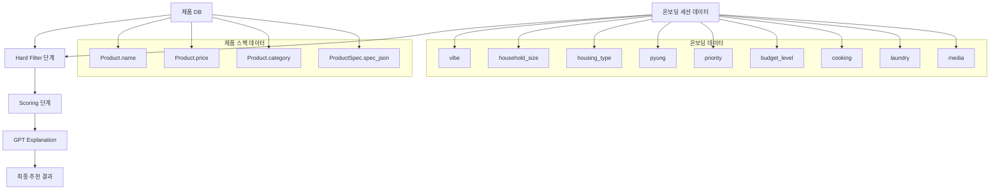

# 온보딩 데이터 ↔ 제품 스펙 파이프라인 연결 시각화

## 📊 전체 파이프라인 플로우



---

## 🔗 칼럼 매핑 상세

### 1단계: Hard Filter (제품 제외/포함 결정)

| 온보딩 칼럼 | 제품 스펙 칼럼 | 연결 로직 | 예시 |
|------------|--------------|----------|------|
| `housing_type = 'studio'` (원룸) | `spec_json['깊이']` 또는 `spec_json['깊이(mm)']` | `depth_mm > 750` → 제외 | 원룸은 냉장고 깊이 750mm 초과 제품 제외 |
| `household_size = 1` | `spec_json['용량']` 또는 `spec_json['세탁 용량']` | `capacity_kg >= 24` → 제외 | 1인 가구는 세탁기 용량 24kg 이상 제외 |
| `budget_level = 'low'` | `Product.price` | `price > 2000000` → 제외 | 저예산 사용자는 200만원 초과 제품 제외 |
| `onboarding_data['media'] = 'none'` | `Product.category` | `category == 'TV'` → 제외 | 미디어 소비 안 하는 사용자는 TV 카테고리 제외 |
| `has_pet = False` | `Product.name` | `name에 '펫' 포함` → 제외 | 반려동물 없는 사용자는 펫 관련 제품 제외 |
| `onboarding_data['cooking'] = 'rarely'` | `Product.name` | `name에 '레인지' 포함` → 제외 | 요리 안 하는 사용자는 레인지 제외 |
| `pyung <= 20` | `spec_json['깊이']` | 카테고리별 크기 제한 | 20평 이하 주택은 대형 가전 제외 |

**필터링 코드 위치**: `api/utils/playbook_filters.py`

---

### 2단계: Scoring Model (점수 계산)

#### 2-1. SpecScore 계산

| 온보딩 칼럼 | 제품 스펙 칼럼 | 점수 로직 | 예시 |
|------------|--------------|----------|------|
| `household_size = 4` | `spec_json['용량']` 또는 `spec_json['총 용량']` | 750~850L 범위 → +10점 | 4인 가족 적정 냉장고 용량 |
| `household_size = 1` | `spec_json['용량']` | `> 500L` → -10점 | 1인 가구 대용량 냉장고 감점 |
| `onboarding_data['media'] = 'heavy'` | `spec_json['패널 타입']` | `OLED` → +10점 | 헤비 미디어 사용자 OLED TV 선호 |
| `onboarding_data['media'] = 'gaming'` | `spec_json['주사율']` | `>= 120Hz` → +7점 | 게임 사용자 고주사율 TV 선호 |
| `selected_space = '드레스룸'` | `Product.category = 'LIVING'` + `name에 '세탁기' 포함` | +5점 | 드레스룸 선택 시 의류 관리 가전 가중치 |

**스코어링 코드 위치**: `api/utils/playbook_scoring.py` → `_calculate_spec_score()`

---

#### 2-2. PreferenceScore 계산

| 온보딩 칼럼 | 제품 스펙 칼럼 | 점수 로직 | 예시 |
|------------|--------------|----------|------|
| `priority = ['design']` | `Product.name`에 'OBJET' 또는 'SIGNATURE' 포함 | `multiplier = 1.5` | 디자인 우선 사용자 오브제/시그니처 가산점 |
| `priority = ['ai_feature']` | `Product.name`에 'ThinQ' 또는 'AI DD' 포함 | `multiplier = 1.5` | AI 기능 우선 사용자 AI 기능 제품 가산점 |
| `priority = ['energy']` | `spec_json['에너지 등급']` | `1등급` → `multiplier = 1.5` | 에너지 효율 우선 사용자 1등급 제품 가산점 |
| `vibe = 'modern'` + `priority = 'tech'` | 카테고리별 스펙 가중치 적용 | `resolution: 0.35, refresh_rate: 0.25, brightness: 0.20` | Modern+Tech 조합 시 해상도/주사율 가중치 높음 |

**스코어링 코드 위치**: `api/utils/playbook_scoring.py` → `_calculate_preference_score()`

---

#### 2-3. LifestyleScore 계산

| 온보딩 칼럼 | 제품 스펙 칼럼 | 점수 로직 | 예시 |
|------------|--------------|----------|------|
| `onboarding_data['cooking'] = 'high'` | `spec_json['용량']` (L) | `> 700L` → +8점 | 요리 빈도 높은 사용자 대용량 냉장고 선호 |
| `onboarding_data['cooking'] = 'high'` | `Product.name`에 '인덕션 3구' 또는 '오븐' 포함 | +5점 | 요리 빈도 높은 사용자 인덕션/오븐 선호 |
| `onboarding_data['laundry'] = 'daily'` | `spec_json['세탁 용량']` (kg) | 적정 용량 범위 → 가산점 | 매일 세탁 패턴에 맞는 용량 |
| `onboarding_data['media'] = 'heavy'` | `spec_json['주사율']` | `>= 120Hz` → +7점 | 헤비 미디어 사용자 고주사율 TV 선호 |

**스코어링 코드 위치**: `api/utils/playbook_scoring.py` → `_calculate_lifestyle_score()`

---

#### 2-4. ReviewScore 계산

| 온보딩 칼럼 | 제품 스펙 칼럼 | 점수 로직 | 예시 |
|------------|--------------|----------|------|
| (온보딩 무관) | `ProductReview` 집계 데이터 | `avg_rating >= 4.7` AND `review_count >= 200` → +8점 | 고평점/다수 리뷰 제품 가산점 |
| (온보딩 무관) | `ProductReview` 집계 데이터 | `negative_keyword_index > 0.5` → -4점 | 부정 키워드 지수 높은 제품 감점 |

**스코어링 코드 위치**: `api/utils/playbook_scoring.py` → `_calculate_review_score()`

---

#### 2-5. PriceScore 계산

| 온보딩 칼럼 | 제품 스펙 칼럼 | 점수 로직 | 예시 |
|------------|--------------|----------|------|
| `budget_level = 'medium'` + `budget_amount = 2000000` | `Product.price` | `price <= budget_amount` → +10점 | 예산 내 제품 가산점 |
| `budget_level = 'medium'` + `budget_amount = 2000000` | `Product.price` | `price > budget_amount * 1.1` → -5점 | 예산 10% 초과 제품 감점 |
| `budget_level = 'medium'` + `budget_amount = 2000000` | `Product.price` | `price > budget_amount * 1.3` → -15점 | 예산 30% 초과 제품 강한 감점 |

**스코어링 코드 위치**: `api/utils/playbook_scoring.py` → `_calculate_price_score()`

---

## 📋 데이터베이스 모델 구조

### OnboardingSession 모델 (온보딩 데이터)

```python
class OnboardingSession(models.Model):
    # Step 1
    vibe = CharField()  # 'modern', 'cozy', 'pop', 'luxury'
    
    # Step 2
    household_size = IntegerField()  # 1, 2, 3, 4, ...
    
    # Step 3
    housing_type = CharField()  # 'apartment', 'detached', 'villa', 'officetel', 'studio'
    pyung = IntegerField()  # 20, 25, 30, ...
    
    # Step 4
    priority = CharField()  # 'design', 'tech', 'eco', 'value'
    
    # Step 5
    budget_level = CharField()  # 'low', 'medium', 'high'
    
    # 추가 데이터 (recommendation_result JSON에 저장)
    recommendation_result = JSONField()  # {
        # 'cooking': 'high', 'often', 'sometimes', 'rarely'
        # 'laundry': 'daily', 'weekly', 'few_times', 'rarely'
        # 'media': 'gaming', 'ott', 'movie', 'balanced', 'none'
        # 'pet': 'yes', 'no'
        # 'main_space': 'living', 'kitchen', 'dressing', 'all'
    }
    
    selected_categories = JSONField()  # ['TV', 'KITCHEN', 'LIVING']
```

**위치**: `api/models.py` (line 166-311)

---

### Product 모델 (제품 기본 정보)

```python
class Product(models.Model):
    name = CharField()  # 'LG 디오스 오브제컬렉션 냉장고'
    model_number = CharField()  # 'DDU4BGE'
    category = CharField()  # 'TV', 'KITCHEN', 'LIVING', 'AIR', ...
    price = DecimalField()  # 2000000
    discount_price = DecimalField()  # 1500000
    image_url = URLField()
```

**위치**: `api/models.py` (line 6-42)

---

### ProductSpec 모델 (제품 스펙 JSON)

```python
class ProductSpec(models.Model):
    product = OneToOneField(Product)  # 1:1 관계
    spec_json = TextField()  # JSON 문자열
    
    # spec_json 파싱 예시:
    # {
    #     "용량": "850L",
    #     "총 용량": "850",
    #     "깊이": "750mm",
    #     "깊이(mm)": "750",
    #     "패널 타입": "OLED",
    #     "해상도": "3840 × 2160",
    #     "주사율": "120Hz",
    #     "세탁 용량": "24kg",
    #     "에너지 등급": "1등급",
    #     "브라이트니스": "800nit",
    #     ...
    # }
```

**위치**: `api/models.py` (line 45-61)

**스펙 파싱 함수**: `api/utils/scoring.py` → `parse_spec_json()` (line 464)

---

## 🔄 파이프라인 단계별 처리

### Step 1: Hard Filter (`api/utils/playbook_filters.py`)

```python
# 1. 온보딩 데이터 + 제품 스펙 조합으로 필터 키 생성
filter_keys = [
    ("원룸", "KITCHEN"),  # housing_type + category
    ("1인", "KITCHEN"),   # household_size + category
    ("예산_low", "전체"),  # budget_level
]

# 2. 정책 테이블에서 규칙 조회
rules = policy_loader.get_hard_filter_rules(filter_key)

# 3. 각 규칙에 따라 제품 제외
if product.spec_json['깊이(mm)'] > 750:
    exclude(product)  # 원룸은 깊이 750mm 초과 제품 제외
```

**정책 테이블**: `api/scoring_logic/hard_filter_rules.json`

---

### Step 2: Scoring Model (`api/utils/playbook_scoring.py`)

```python
# 5개 컴포넌트 점수 계산
score_breakdown = ScoreBreakdown()

# 1. SpecScore
score_breakdown.spec_score = calculate_spec_score(
    product.spec_json['용량'],
    user_profile['household_size']
)

# 2. PreferenceScore
score_breakdown.preference_score = calculate_preference_score(
    product.name,
    user_profile['priority']
)

# 3. LifestyleScore
score_breakdown.lifestyle_score = calculate_lifestyle_score(
    product.spec_json,
    onboarding_data['cooking'],
    onboarding_data['laundry']
)

# 4. ReviewScore
score_breakdown.review_score = calculate_review_score(
    product.reviews
)

# 5. PriceScore
score_breakdown.price_score = calculate_price_score(
    product.price,
    user_profile['budget_amount']
)

# 최종 점수 합산
total_score = (
    score_breakdown.spec_score +
    score_breakdown.preference_score +
    score_breakdown.lifestyle_score +
    score_breakdown.review_score +
    score_breakdown.price_score
)
```

**정책 테이블**: `api/scoring_logic/weight_rules.json`

---

### Step 3: GPT Explanation Layer (`api/services/playbook_explanation_generator.py`)

```python
explanation = {
    'why_summary': f"{score_breakdown.spec_score:.0f}점의 스펙 점수로...",
    'lifestyle_message': f"{household_size}인 가족의 {cooking} 요리 패턴에 맞춰...",
    'design_message': f"{vibe} 인테리어와 어울리는...",
    'review_highlight': f"{avg_rating}점의 평균 평점으로..."
}
```

---

## 🎯 실제 예시: 냉장고 추천

### 입력 데이터 (온보딩)

```json
{
    "vibe": "modern",
    "household_size": 4,
    "housing_type": "apartment",
    "pyung": 30,
    "priority": ["tech", "value"],
    "budget_level": "medium",
    "budget_amount": 2000000,
    "categories": ["KITCHEN"],
    "onboarding_data": {
        "cooking": "high",
        "laundry": "weekly",
        "media": "balanced"
    }
}
```

### 제품 스펙 데이터

```json
{
    "name": "LG 디오스 오브제컬렉션 냉장고",
    "category": "KITCHEN",
    "price": 1800000,
    "spec_json": {
        "용량": "850L",
        "총 용량": "850",
        "깊이": "680mm",
        "에너지 등급": "1등급"
    }
}
```

### 파이프라인 처리

1. **Hard Filter**: 통과 (깊이 680mm < 750mm, 가격 180만원 < 200만원)

2. **Scoring**:
   - **SpecScore**: +10점 (4인 가족 적정 용량 850L)
   - **PreferenceScore**: +8점 (Tech+Value 조합 가중치)
   - **LifestyleScore**: +8점 (요리 빈도 높음, 대용량 냉장고)
   - **ReviewScore**: +6점 (평균 평점 4.5점)
   - **PriceScore**: +10점 (예산 내)
   - **TotalScore**: 42점

3. **Explanation**:
   ```
   "4인 가족의 요리 빈도가 높은 라이프스타일에 맞춰 850L 용량의 
   디오스 냉장고를 추천합니다. 예산 범위 내 합리적인 가격으로 
   제공됩니다."
   ```

---

## 📁 관련 파일 위치

| 파일 | 역할 |
|------|------|
| `api/models.py` | 데이터베이스 모델 정의 |
| `api/utils/playbook_filters.py` | Hard Filter 로직 |
| `api/utils/playbook_scoring.py` | Scoring Model 로직 |
| `api/utils/product_filters.py` | 스펙 추출 유틸리티 |
| `api/utils/scoring.py` | 스펙 파싱 유틸리티 |
| `api/services/playbook_recommendation_engine.py` | 전체 파이프라인 오케스트레이션 |
| `api/scoring_logic/hard_filter_rules.json` | Hard Filter 정책 테이블 |
| `api/scoring_logic/weight_rules.json` | Weight 정책 테이블 |

---

## 🔍 주요 함수 호출 체인

```
PlaybookRecommendationEngine.get_recommendations()
    ↓
1. _apply_hard_filter()
    → PlaybookHardFilter.apply_filters()
        → get_product_spec(product)  # spec_json 파싱
        → extract_capacity(spec)     # 용량 추출
        → extract_size(spec)         # 크기 추출
    ↓
2. _score_products()
    → PlaybookScoringModel.calculate_product_score()
        → parse_spec_json(product)   # spec_json 파싱
        → _calculate_spec_score()
        → _calculate_preference_score()
        → _calculate_lifestyle_score()
        → _calculate_review_score()
        → _calculate_price_score()
    ↓
3. _format_recommendation_with_explanation()
    → PlaybookExplanationGenerator.generate_explanation()
```

---

## ✅ 요약

**온보딩 데이터** → **Hard Filter** → **Scoring Model** → **GPT Explanation** → **최종 추천**

1. **온보딩 칼럼**: `household_size`, `housing_type`, `priority`, `cooking`, `laundry`, `media` 등
2. **제품 스펙 칼럼**: `spec_json['용량']`, `spec_json['깊이']`, `spec_json['주사율']`, `Product.price` 등
3. **연결 방식**: 정책 테이블(JSON) 기반 규칙 매칭 + 직접 비교 연산
4. **점수 계산**: 5개 컴포넌트 (SpecScore, PreferenceScore, LifestyleScore, ReviewScore, PriceScore) 합산


